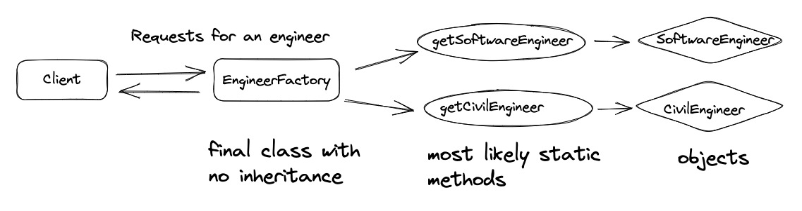
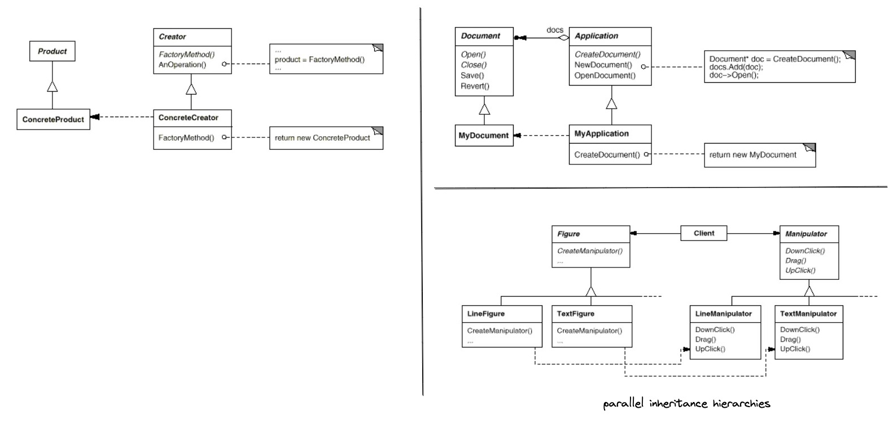
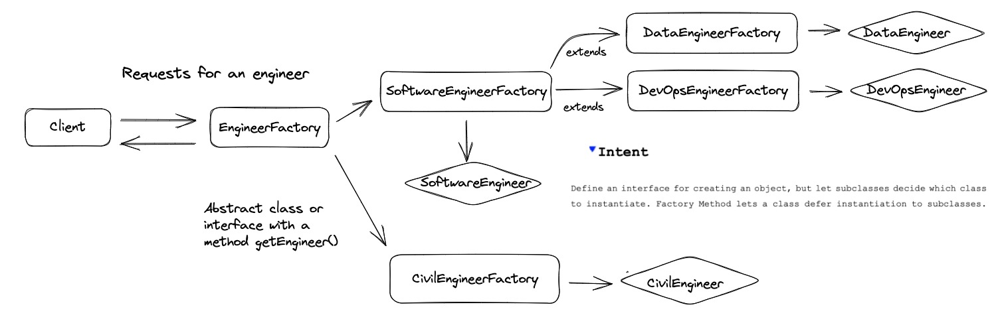
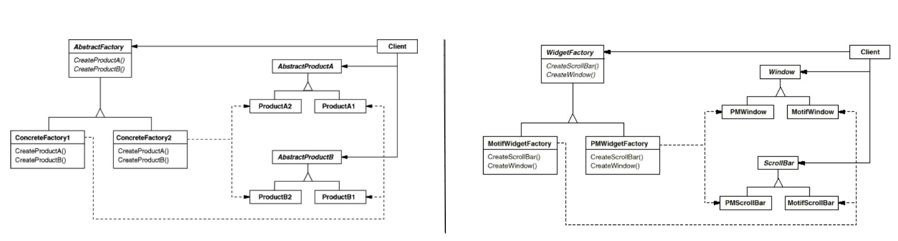
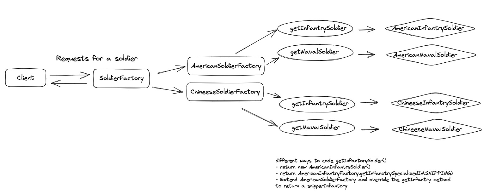
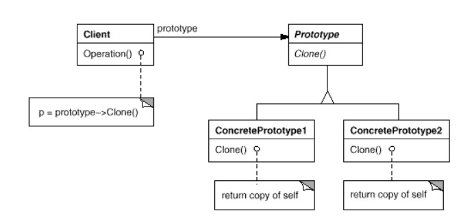
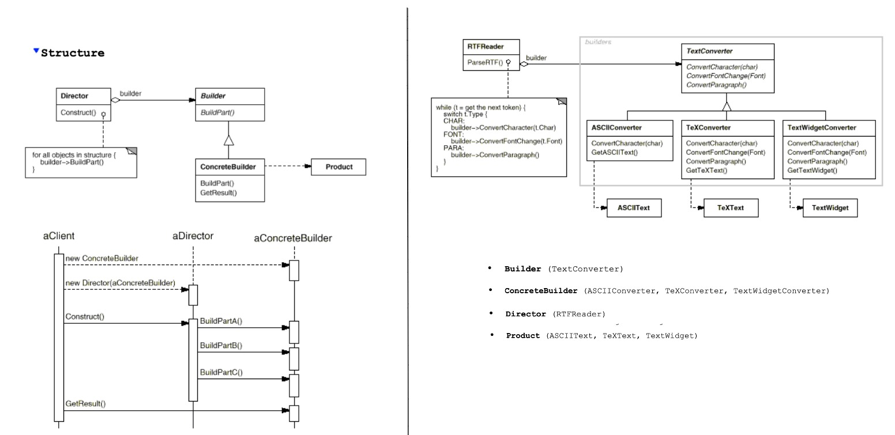

# gof-impl-java
Discovering the design patterns in GOF way

#### This repo contains my personal notes and practice based on my understanding of the design patterns discussed in GOF book.

# Criteria (Scope)
- Class (The pattern primarily applies to classes,relationship between classes and subclasses, established through inheritance, static, fixed at compile time)
- Object(The pattern primarily applies to objects, dynamic, can be changed at runtime)

# Criteria (Prupose)
- Creational : Concerns the process of object creation.Creational `class` design patterns defer some part of the object creation to subclasses while creation `object` patterns defer it to another object.
- Structural : Deals with the composition of classes and objects. The structural `class` patterns use inheritance to compose classes while structural `object` patterns describe ways to assemble objects.
- Behavioral : Characterizes the way classes or objects interact and distribute responsibility.The behavioral `class` patterns use inheritance to describe algorithms and flow of control while behavioral `object` patterns describe how a group of objects co-operate to perform a task that no single object can carry out alone.
# Note
- Creational patterns deal with object creation. Creational design patterns defer some part of the object creation to subclasses while creation object patterns defer it to another object.
- Structural pattern deals with the composition of classes or objects. The structural class patterns use inheritance to compose classes while structural object patterns describe ways to assemble objects.
-  Behavioral patterns characterize the ways in which classes or objects interact and distribute responsibility.The behavioral class patterns use inheritance to describe algorithms and flow of control while behavioral object patterns describe how a group of objects co-operate to perform a task that no single object can carry our alone.

# Creational Patterns:
## Simple Factory(Static) vs Factory Method vs Abstract Factory

### Simple Factory(Static)

### Factory Method (*Scope - Class*)

### Abstract factory (*Scope - Object*)

### Prototype
- Let's assume you have an object which is very expensive to create(The cached result of an AI model, A object with a tcp connection and some metadata, an object containing the response of a REST API etc) and the software requires a new instance of the object. In this scenario, we can use prototype design pattern which demonstrates how to create a copy of an existing object. It can be shallow copy or deep copy depending on the use case and can be tackled at implementation level. Java Object.clone() method and Cloneable interface is an example.

### Builder

`It separates the construction of a complex object from its representation so that the same construction processes can create different representations.` - GOF